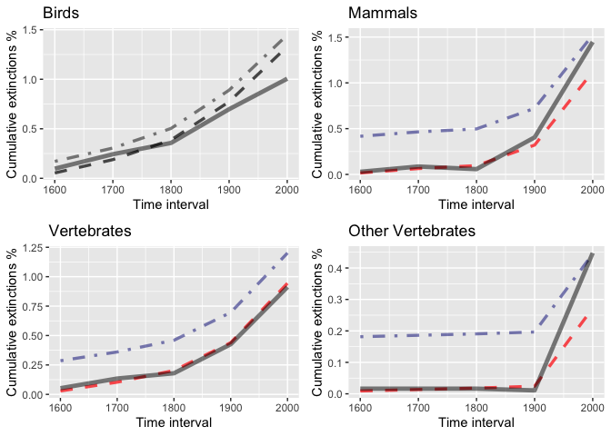

The Sixth Mass Extinctions
================
Alice Hua, Chancey Quam

## Mass Extinctions Module

*Are we experiencing the sixth great extinction?*

What is the current pace of vetebrates extinction rates? Is it
accelerating? How does it compare to background extinction rates? How do
we account for NA values in the data?

## Background

  - [Section Intro Video](https://youtu.be/QsH6ytm89GI)
  - [Ceballos et al (2015)](http://doi.org/10.1126/sciadv.1400253)

Our focal task will be to reproduce the result from Ceballos and
colleagues showing the recent increase in extinction rates relative to
the background rate, as well as looking at different results of
extinction rates from including and excluding NA values.


## Computational Topics

  - Accessing data from a RESTful API
  - Error handling
  - JSON data format
  - Regular expressions
  - Working with missing values

## Additional references:

  - <http://www.hhmi.org/biointeractive/biodiversity-age-humans> (Video)
  - [Barnosky et al. (2011)](http://doi.org/10.1038/nature09678)
  - [Pimm et al (2014)](http://doi.org/10.1126/science.1246752)
  - [Sandom et al (2014)](http://dx.doi.org/10.1098/rspb.2013.3254)

### Data about the species:

Here we use RESTful API to read in data about all species evaluated by
the IUCN Red List.

``` r
species_ap <- "https://apiv3.iucnredlist.org/api/v3/species"
page <- "/page/"
page_number <- 0:10
query <- "?token="
token <- "9bb4facb6d23f48efbf424bb05c0c1ef1cf6f468393bc745d42179ac4aca5fee"

#write a function to get http, clue everything together to make a url that iterates over the vector of page_number
all_pages <- paste0(species_ap, page, page_number, query, token)
```

We will get the results for all 10 pages, each has 10,000 records of all
species published.

``` r
#apply map to all_pages a vector
all_results <- map(all_pages, GET)
```

Let’s look at the names of the
data.

``` r
row <- all_results[[1]] %>% content() %>% getElement("result") %>% getElement(1)
names(row)
```

``` 
 [1] "taxonid"         "kingdom_name"    "phylum_name"     "class_name"     
 [5] "order_name"      "family_name"     "genus_name"      "scientific_name"
 [9] "infra_rank"      "infra_name"      "population"      "category"       
```

Using the names we got above, here we turn the data into “rectangular”
dataframe. According to the paper by Ceballos on species extinctions,
both extinct species and extinct in the wild species were selected to
make their final graph. To reproduce their result, we are filtering to
have only species under these two categories.

``` r
row_to_tibble <- function(row){
  tibble(scientific_name = row$scientific_name, 
         category = row$category, 
         phylum = row$phylum_name,
         class = row$class_name)
}

get_result <- function(x){
  x %>% content() %>% getElement("result") %>% 
  map_dfr(row_to_tibble)
}
```

``` r
all_species <- all_results  %>% map_dfr(get_result) %>% filter(category=="EX"| category=="EW")
all_species
```

    # A tibble: 989 x 4
       scientific_name            category phylum     class         
       <chr>                      <chr>    <chr>      <chr>         
     1 Mirogrex hulensis          EX       CHORDATA   ACTINOPTERYGII
     2 Acanthametropus pecatonica EX       ARTHROPODA INSECTA       
     3 Achatinella abbreviata     EX       MOLLUSCA   GASTROPODA    
     4 Achatinella buddii         EX       MOLLUSCA   GASTROPODA    
     5 Achatinella caesia         EX       MOLLUSCA   GASTROPODA    
     6 Achatinella casta          EX       MOLLUSCA   GASTROPODA    
     7 Achatinella decora         EX       MOLLUSCA   GASTROPODA    
     8 Achatinella dimorpha       EX       MOLLUSCA   GASTROPODA    
     9 Achatinella elegans        EX       MOLLUSCA   GASTROPODA    
    10 Achatinella juddii         EX       MOLLUSCA   GASTROPODA    
    # ... with 979 more rows

We can see that 989 species went extinct or extinct in the wild. Let’s
see the unique phylums of those species. For the purpose of
reproducibility, we will select only the species of Chordata phylum
because they are
vertebrates.

``` r
unique(all_species$phylum)
```

``` 
[1] "CHORDATA"        "ARTHROPODA"      "MOLLUSCA"        "NEMERTINA"      
[5] "PLATYHELMINTHES" "TRACHEOPHYTA"    "BRYOPHYTA"       "ANNELIDA"       
[9] "RHODOPHYTA"     
```

### Data about the species extinction dates:

Lets get the extinction dates for these species. The data is store in
the narrative text for each species. Again, we are setting up the urls
to be called in the RESTful API.

``` r
all_extinct <- all_species %>% pull(scientific_name)

base <- "https://apiv3.iucnredlist.org"
narrative <- "/api/v3/species/narrative/"
name_group1 <- all_extinct
query <- "?token="
token <- "9bb4facb6d23f48efbf424bb05c0c1ef1cf6f468393bc745d42179ac4aca5fee"
url <- paste0(base, narrative, name_group1, query, token)
```

We have already called the urls for all the extinct species (this will
take awhile) and saved it as an R object RDS. The code chunk below will
load the object if the file exists or it will download the data if the
file doesn’t exist. Then this object consists narratives of all extinct
and extinct in the wild species is read into all\_data.

``` r
if (!file.exists("massive_resp.rds")){
  resp <- map(url, GET)
  saveRDS(resp, "massive_resp.rds")
} else {
  all_data <- readRDS("massive_resp.rds")
}
```

We will need to get the rationale section for each species in order to
find out what dates they went extinct. Here are the narratives of the
species, the narratives that are NULL are stored as NA.

``` r
map_chr_na <- possibly(map_chr, as.character(NA))

narrative <- all_data %>% map(content) %>% map("result") %>% 
  map(map_chr_na, "rationale")
```

Lets extract the extinction date for species that have dates in their
narrative. We created a custom function to extract any 4 digit number
from the rationales. We then unlist them as they are nested in lists.

``` r
extinc_year <- map(narrative, function(x){
  str_extract_all(x, "\\d{4}") %>% 
  unlist()
}) 
```

We will bin the years for all species into the specific bins for our
final graph. Since we are using bins of an 100-year interval. It is
reasonable to put them in these bins. For rationales of species that
contain more than one year, if the years are within the 100-year
interval, we will collapse them into the same bin. If they are not
within the 100-year interval however, we will select the latest year and
put it in the corresponding bin. We chose to do so because we observed
that the narratives have a tendency to list the last seen date as the
date of approximate extinction. Lastly, if there is no narrative, or
Null values, we will give them NA as values.

``` r
bin_year <- function(x) {
  x = as.integer(x)
    case_when(
      between(x, 1500, 1600) ~ "1600",
      between(x, 1600, 1700) ~ "1700",
      between(x, 1700, 1800) ~ "1800",
      between(x, 1800, 1900) ~ "1900",
      between(x, 1900, 2020) ~ "2000",
      !between(x, 1500, 2020) ~ as.character("not a year"),
      length(x) < 1 ~ as.character(NA)) %>%
      unique() %>%
      max()
}
```

Here we apply our binning function to all the years that we extracted
from the species rationale to come up an extinction date for each
species. It is important to note that we assigned all null narratives
which were replaced to NAs by our binning function earlier to have 1600
as its values. This is because we will calculate the cumulative sum for
each group of species, the cumulative sum would start at the beginning
and continue to the latest year bin, which means that all the species of
null dates will get counted from the beginning of our time series and
continued to be counted to the end. This would be our maximum possible
species that have gone extinct.

``` r
all_year <- 
  extinc_year %>% 
  map(possibly(bin_year, NA_real_)) %>%
  as.integer() %>% 
  replace_na(1600)
```

Here we are adding the extinction dates (including dates of NA values
that are binned into 1600) for 989 species calculated above to our table
of 989 species consists of EX - Extinct and EW - Extinct in the Wild
species.

``` r
all_species_with_year <- all_species %>%
  mutate(extinct_year = all_year)
all_species_with_year
```

    # A tibble: 989 x 5
       scientific_name            category phylum     class          extinct_year
       <chr>                      <chr>    <chr>      <chr>                 <dbl>
     1 Mirogrex hulensis          EX       CHORDATA   ACTINOPTERYGII         2000
     2 Acanthametropus pecatonica EX       ARTHROPODA INSECTA                1600
     3 Achatinella abbreviata     EX       MOLLUSCA   GASTROPODA             1600
     4 Achatinella buddii         EX       MOLLUSCA   GASTROPODA             1600
     5 Achatinella caesia         EX       MOLLUSCA   GASTROPODA             1600
     6 Achatinella casta          EX       MOLLUSCA   GASTROPODA             1600
     7 Achatinella decora         EX       MOLLUSCA   GASTROPODA             1600
     8 Achatinella dimorpha       EX       MOLLUSCA   GASTROPODA             1600
     9 Achatinella elegans        EX       MOLLUSCA   GASTROPODA             1600
    10 Achatinella juddii         EX       MOLLUSCA   GASTROPODA             1600
    # … with 979 more rows

To reproduce a similar result to Ceballos’s final graph, we did the
following - We sorted the species with extinction dates into 4 different
groups: Mammals, Birds, Vertebrates and Other Vertebrates. We included
Mammals, Birds and Amphibians in the Vertebrates group. For the Other
Vertebrates group, we excluded Mammals and Birds and included all
species in the Chordata phylum, which includes all other vertebrates.

``` r
verte <- c("MAMMALIA","AVES","AMPHIBIA")

birds <- all_species_with_year %>% 
  filter(class == "AVES") %>% mutate(group = "Birds")

mammals <- all_species_with_year %>% 
  filter(class == "MAMMALIA") %>% mutate(group = "Mammals")

vertebrate <- all_species_with_year %>% 
  filter(class %in% verte) %>% mutate(group = "Vertebrates")

all_others <- all_species_with_year %>% 
  filter(phylum == "CHORDATA") %>% 
  filter(!class %in% c("MAMMALIA", "AVES")) %>% 
  mutate(group = "Other Vertebrates")
```

Here, we calculate the cumulative sums for each group and create a new
table with all groups combined.

``` r
count_sum <- function(table) {
  new_table <- table %>%
  group_by(extinct_year, group)%>%
  summarize(count = n()) %>%
  ungroup() %>%
  mutate(cum_sum = cumsum(count))
  return(new_table)
}

birds_sum <- count_sum(birds)
mam_sum <- count_sum(mammals)
vert_sum <- count_sum(vertebrate)
other_sum <- count_sum(all_others)

all_types <- rbind(birds_sum, mam_sum, vert_sum, other_sum)
all_types
```

    # A tibble: 19 x 4
       extinct_year group             count cum_sum
              <dbl> <chr>             <int>   <int>
     1         1600 Birds                19      19
     2         1700 Birds                15      34
     3         1800 Birds                22      56
     4         1900 Birds                43      99
     5         2000 Birds                62     161
     6         1600 Mammals              26      26
     7         1700 Mammals               3      29
     8         1800 Mammals               2      31
     9         1900 Mammals              14      45
    10         2000 Mammals              50      95
    11         1600 Vertebrates          69      69
    12         1700 Vertebrates          18      87
    13         1800 Vertebrates          24     111
    14         1900 Vertebrates          57     168
    15         2000 Vertebrates         122     290
    16         1600 Other Vertebrates    60      60
    17         1800 Other Vertebrates     3      63
    18         1900 Other Vertebrates     2      65
    19         2000 Other Vertebrates    82     147

Now, we also need to get the total of all species (with and without
being classified as extinct or extinct in the wild) for each group, this
will be our denominator for the cumulative percentage calculation at the
end.

``` r
all_species_eval <-all_results  %>% map_dfr(get_result)
```

``` r
birds_total  <- birds <- all_species_eval %>% 
  filter(class == "AVES") %>% mutate(group = "Birds")

mammal_total <- mammals <- all_species_eval %>% 
  filter(class == "MAMMALIA") %>% mutate(group = "Mammals")

vert_total <- vertebrate <- all_species_eval %>% 
  filter(class %in% verte) %>% mutate(group = "Vertebrates")

other_total <- all_others <- all_species_eval %>% 
  filter(phylum == "CHORDATA") %>% 
  filter(!class %in% c("MAMMALIA", "AVES")) %>% 
  mutate(group = "Other Vertebrates")
```

In order to arrive at the fractions of cumulative extinctions as
percentages of IUCN-evaluated species, we need to divide the total of a
species of each group in each bin to the total number of that species.
To get each group total count, we made a new table to have only total
counts for 4 groups (birds, mammals, vertebrate, other vertebrates). We
joined this table to our current master extict table to create another
more comprehensive table where the total counts and species counts per
bin year, so that we can derive the cumulative percentages.

``` r
group_total <- data.frame(group = 
                                  c("Birds", "Mammals", "Vertebrates", "Other Vertebrates"),                                    
                          sum_species = 
                                  c(nrow(birds_total), nrow(mammal_total),                                                      nrow(vert_total),nrow(other_total)))

master_ex_table <- all_types %>%
  left_join(group_total) %>%
  mutate(perc_ex_withNA = 100*(cum_sum/ sum_species))
```

    Joining, by = "group"

    Warning: Column `group` joining character vector and factor, coercing into
    character vector

``` r
master_ex_table
```

    # A tibble: 19 x 6
       extinct_year group             count cum_sum sum_species perc_ex_withNA
              <dbl> <chr>             <int>   <int>       <int>          <dbl>
     1         1600 Birds                19      19       11126          0.171
     2         1700 Birds                15      34       11126          0.306
     3         1800 Birds                22      56       11126          0.503
     4         1900 Birds                43      99       11126          0.890
     5         2000 Birds                62     161       11126          1.45 
     6         1600 Mammals              26      26        6237          0.417
     7         1700 Mammals               3      29        6237          0.465
     8         1800 Mammals               2      31        6237          0.497
     9         1900 Mammals              14      45        6237          0.722
    10         2000 Mammals              50      95        6237          1.52 
    11         1600 Vertebrates          69      69       24135          0.286
    12         1700 Vertebrates          18      87       24135          0.360
    13         1800 Vertebrates          24     111       24135          0.460
    14         1900 Vertebrates          57     168       24135          0.696
    15         2000 Vertebrates         122     290       24135          1.20 
    16         1600 Other Vertebrates    60      60       33056          0.182
    17         1800 Other Vertebrates     3      63       33056          0.191
    18         1900 Other Vertebrates     2      65       33056          0.197
    19         2000 Other Vertebrates    82     147       33056          0.445

Lets’ visualize these maximum possible extinction rates that we
calculated by including NA dates in the year bin of
1600.

``` r
master_ex_table %>% ggplot(aes(x = factor(extinct_year), group = group, color = group)) +
  geom_line(aes(y = perc_ex_withNA), lwd = 1.5) +
  labs(title = "Cumulative Vertebrate Species as EX or EW by the IUCN 2019",
       y = 'Cumulative extinctions as % of UCN-evaluated species',
       x = "Time interval") + 
  scale_x_discrete(labels=c("1500-1600", "1600-1700", "1700-1800", "1800-1900", "1900-2000")) +
  scale_y_continuous(breaks = seq(0,2, by=0.2)) +
  theme_classic() +
  theme(text = element_text(size=10))
```

<!-- -->

Comparing to the Fig. 1 graph in Ceballos’s paper, we see that the graph
was made using IUCN data as of 2012. It has been almost 8 years since
then. We therefore suspect that our graph is reflecting the changes in
the extinction rates. Particularly, we see an elevated rate of
extinction for the vertebrates group. However, we can only say that this
result shows the maximum possible veterbrate extinctions with N.A values
for extinction dates accounted for. Now, We want to reproduce the data
without the NA values to see the difference.

``` r
all_year_noNA <- 
  extinc_year %>% 
  map(possibly(bin_year, NA_real_)) %>%
  as.integer()

all_species_noNA <- all_species %>%
  mutate(extinct_year = all_year_noNA) %>%
  drop_na()
all_species_noNA
```

    # A tibble: 548 x 5
       scientific_name                  category phylum     class       extinct_year
       <chr>                            <chr>    <chr>      <chr>              <int>
     1 Mirogrex hulensis                EX       CHORDATA   ACTINOPTER…         2000
     2 Acipenser nudiventris            EX       CHORDATA   ACTINOPTER…         2000
     3 Afrocyclops pauliani             EX       ARTHROPODA MAXILLOPODA         2000
     4 Alasmidonta robusta              EX       MOLLUSCA   BIVALVIA            2000
     5 Alasmidonta wrightiana           EX       MOLLUSCA   BIVALVIA            2000
     6 Alasmidonta mccordi              EX       MOLLUSCA   BIVALVIA            2000
     7 Alburnus akili                   EX       CHORDATA   ACTINOPTER…         2000
     8 Alcelaphus buselaphus ssp. buse… EX       CHORDATA   MAMMALIA            2000
     9 Pholidoscelis cineraceus         EX       CHORDATA   REPTILIA            2000
    10 Aphanius splendens               EX       CHORDATA   ACTINOPTER…         2000
    # … with 538 more rows

Our table without the rows of NA values for extinct year now has only
548 species. This number is only around 58% of all extinct species.
Lets’ similarly filter this no NA dataframe for the same vertebrate
groups of species that we are interested in.

``` r
birds_noNa <- all_species_noNA %>% 
  filter(class == "AVES") %>% mutate(group = "Birds")

mammals_noNa <- all_species_noNA %>% 
  filter(class == "MAMMALIA") %>% mutate(group = "Mammals")

vertebrate_noNa <- all_species_noNA %>% 
  filter(class %in% verte) %>% mutate(group = "Vertebrates")

all_others_noNa <- all_species_noNA %>% 
  filter(phylum == "CHORDATA") %>% 
  filter(!class %in% c("MAMMALIA", "AVES")) %>% 
  mutate(group = "Other Vertebrates")
```

We calculate the cumulative sums for each group as we did for the
earlier data with NA values accounted for. We will add our results into
the master table earlier where extinction percentages included NA values
in the cummulative sum.

``` r
birds_sum_noNa <- count_sum(birds_noNa)
mam_sum_noNa <- count_sum(mammals_noNa)
vert_sum_noNa <- count_sum(vertebrate_noNa)
other_sum_noNa <- count_sum(all_others_noNa)

all_types_noNa <- rbind(birds_sum_noNa, mam_sum_noNa, vert_sum_noNa, other_sum_noNa)

master_noNA <- all_types_noNa %>%
  left_join(group_total) %>%
  mutate(perc_extinct_noNA = 100*(cum_sum/ sum_species))
```

    Joining, by = "group"

    Warning: Column `group` joining character vector and factor, coercing into
    character vector

``` r
master_ex_table <- master_ex_table %>%
  select(extinct_year, group, sum_species, perc_ex_withNA) %>%
  mutate(perc_ex_noNA = master_noNA$perc_extinct_noNA)
```

    Warning in inds_combine(.vars, ind_list): '.Random.seed[1]' is not a valid
    integer, so ignored

``` r
master_ex_table
```

``` 
# A tibble: 19 x 5
   extinct_year group             sum_species perc_ex_withNA perc_ex_noNA
          <dbl> <chr>                   <int>          <dbl>        <dbl>
 1         1600 Birds                   11126          0.171      0.0539 
 2         1700 Birds                   11126          0.306      0.189  
 3         1800 Birds                   11126          0.503      0.386  
 4         1900 Birds                   11126          0.890      0.773  
 5         2000 Birds                   11126          1.45       1.33   
 6         1600 Mammals                  6237          0.417      0.0160 
 7         1700 Mammals                  6237          0.465      0.0641 
 8         1800 Mammals                  6237          0.497      0.0962 
 9         1900 Mammals                  6237          0.722      0.321  
10         2000 Mammals                  6237          1.52       1.12   
11         1600 Vertebrates             24135          0.286      0.0290 
12         1700 Vertebrates             24135          0.360      0.104  
13         1800 Vertebrates             24135          0.460      0.203  
14         1900 Vertebrates             24135          0.696      0.439  
15         2000 Vertebrates             24135          1.20       0.945  
16         1600 Other Vertebrates       33056          0.182      0.00908
17         1800 Other Vertebrates       33056          0.191      0.0182 
18         1900 Other Vertebrates       33056          0.197      0.0242 
19         2000 Other Vertebrates       33056          0.445      0.272  
```

Lets’ visualize the extinction percentages that we calculated excluding
extinction records that had NA values for extinction
dates.

``` r
master_ex_table %>% ggplot(aes(x = factor(extinct_year), group = group, color = group)) +
  geom_line(aes(y = perc_ex_withNA), lwd = 1.0) +
  geom_line(aes(y = perc_ex_noNA), lwd = 1.0, linetype = "dashed") +
  labs(title = "Cumulative Vertebrate Species as EX or EW by the IUCN 2019",
       y = 'Cumulative extinctions as % of UCN-evaluated species',
       x = "Time interval") + 
  scale_x_discrete(labels=c("1500-1600", "1600-1700", "1700-1800", "1800-1900", "1900-2000")) +
  scale_y_continuous(breaks = seq(0,2, by=0.2)) +
  theme_classic() +
  theme(text = element_text(size=10))
```

<!-- -->

The graph above shows the highest and lowest possible extinction
percentages for all veterbrates. The solid lines represent the highest
values which were generated by including NAs in our initial year bin.
The dashed lines represent the lowest values which were generated by
excluding species with NAs as extinction dates. We think that the real
percentages of vertebrates extinction are somewhere in between these two
lines for each group of species. To come up with a line that is in
between the highest and lowest lines, we will interpolate the
percentages for each bin by projecting the same proportions of species
in each bin in our previous lowest possible data (without NA values).
Then, we will add the counts derived from the projected proportions of
NAs to the lowest possible species count, then find the cumulative
percentages by dividing by the common denominator we have been using,
total species evaluated.

First, we start with finding the total number of extinctions of NA dates
by subtracting the number of rows in our lowest, no NA dates table from
the highest, with NA dates table.

``` r
na_total <- nrow(all_species_with_year) - nrow(all_species_noNA)
na_total
```

    [1] 441

We see that the total number of extinctions that did not have an
extinction date is about 47% of all extinct species. If we were to leave
the species with NA dates out of our final conclusion, that would tell
an unaccurate story of the verterbrates extinction overall. Here we
derive a count for each group of NA dates by projecting the same
proportions of species per bin in our lowest possible extinction data.

``` r
year_group <- master_noNA %>% arrange(extinct_year) %>%
  select(extinct_year, count, group) %>%
  group_by(extinct_year, group) %>%
  summarise(noNA_total= sum(count)) %>%
  mutate(noNA_percent = noNA_total/nrow(all_species_noNA),
                         NA_derived_count = noNA_percent * na_total) %>% 
  select(group, NA_derived_count) 
```

    Adding missing grouping variables: `extinct_year`

``` r
year_group
```

``` 
# A tibble: 19 x 3
# Groups:   extinct_year [5]
   extinct_year group             NA_derived_count
          <int> <chr>                        <dbl>
 1         1600 Birds                        4.83 
 2         1600 Mammals                      0.805
 3         1600 Other Vertebrates            2.41 
 4         1600 Vertebrates                  5.63 
 5         1700 Birds                       12.1  
 6         1700 Mammals                      2.41 
 7         1700 Vertebrates                 14.5  
 8         1800 Birds                       17.7  
 9         1800 Mammals                      1.61 
10         1800 Other Vertebrates            2.41 
11         1800 Vertebrates                 19.3  
12         1900 Birds                       34.6  
13         1900 Mammals                     11.3  
14         1900 Other Vertebrates            1.61 
15         1900 Vertebrates                 45.9  
16         2000 Birds                       49.9  
17         2000 Mammals                     40.2  
18         2000 Other Vertebrates           66.0  
19         2000 Vertebrates                 98.2  
```

We then add this derived-NA species count to our lowest possible
count(without NAs), and divide by the total of all evaluated species to
find the cumulative percentages of the line in between the maximum and
minimum vertebrates extinction.

``` r
uncertain_perc <- master_noNA %>% 
  left_join(year_group) %>%
  mutate(count_low_NA = count + NA_derived_count) %>%
  group_by(extinct_year, group) %>%
  summarize(cumsum_lowNA = cumsum(count_low_NA))
```

    Joining, by = c("extinct_year", "group")

``` r
master_ex_table <- master_ex_table %>%
  left_join(uncertain_perc) %>%
  mutate(perc_ex_uncertain = 100*(cumsum_lowNA/sum_species)) %>%
  select(extinct_year, group, sum_species, perc_ex_withNA, perc_ex_noNA, perc_ex_uncertain)
```

    Joining, by = c("extinct_year", "group")

``` r
master_ex_table
```

    # A tibble: 19 x 6
       extinct_year group   sum_species perc_ex_withNA perc_ex_noNA perc_ex_uncerta…
              <dbl> <chr>         <int>          <dbl>        <dbl>            <dbl>
     1         1600 Birds         11126          0.171      0.0539            0.0973
     2         1700 Birds         11126          0.306      0.189             0.243 
     3         1800 Birds         11126          0.503      0.386             0.357 
     4         1900 Birds         11126          0.890      0.773             0.698 
     5         2000 Birds         11126          1.45       1.33              1.01  
     6         1600 Mammals        6237          0.417      0.0160            0.0289
     7         1700 Mammals        6237          0.465      0.0641            0.0868
     8         1800 Mammals        6237          0.497      0.0962            0.0579
     9         1900 Mammals        6237          0.722      0.321             0.405 
    10         2000 Mammals        6237          1.52       1.12              1.45  
    11         1600 Verteb…       24135          0.286      0.0290            0.0523
    12         1700 Verteb…       24135          0.360      0.104             0.135 
    13         1800 Verteb…       24135          0.460      0.203             0.179 
    14         1900 Verteb…       24135          0.696      0.439             0.426 
    15         2000 Verteb…       24135          1.20       0.945             0.912 
    16         1600 Other …       33056          0.182      0.00908           0.0164
    17         1800 Other …       33056          0.191      0.0182            0.0164
    18         1900 Other …       33056          0.197      0.0242            0.0109
    19         2000 Other …       33056          0.445      0.272             0.448 

Lets’ put these results on multiple graphs to observe the differences,
we have delved deeper into the data and explored different permutations
of dealing with NA values. The graph below has a similar order of
species groups as Cebellos, from high to low: Mammals, Birds,
Vertebrates and Other vertebrates.

``` r
master_ex_table %>% 
  ggplot(aes(x = extinct_year, color = group)) +
  geom_line(aes(y = perc_ex_withNA), linetype = "dotdash", lwd=1, alpha =0.5) +
  geom_line(aes(y = perc_ex_noNA), linetype = "longdash", lwd =1, alpha = 0.5) +
  geom_line(aes(y = perc_ex_uncertain), linetype = "solid", lwd = 1.5, alpha=0.7) +
  labs(title = "Cumulative Vertebrate Species as EX or EW by the IUCN 2019",
       y = 'Cumulative extinctions as % of UCN-evaluated species',
       x = "Time interval") + 
  scale_x_discrete(labels=c("1500-1600", "1600-1700", "1700-1800", "1800-1900", "1900-2000")) +
  scale_y_continuous(breaks = seq(0,2, by=0.2)) +
  theme_classic() +
  theme(text = element_text(size=10))
```

<!-- -->

Perhaps the dashed lines above are hard to decipher. The dotted dash
lines represent the highest possible extinction rates and the long dash
lines represent the lowest, the solid lines are our interpolated
uncertainty lines where NA data is projected to have the same
proportions as the data without NAs(the lowest possible rates) plus the
data wihout NAs itself. Lets’ look individual species group and their
different extinction rates.

``` r
plot1 <- master_ex_table %>% filter(group == "Birds") %>%
  ggplot(aes(x = extinct_year), color = "blue") +
  geom_line(aes(y = perc_ex_withNA), linetype = "dotdash", lwd=1.2, alpha =0.5) +
  geom_line(aes(y = perc_ex_noNA), linetype = "dashed", lwd=1.2, alpha =0.7) +
  geom_line(aes(y = perc_ex_uncertain), linetype = "solid", lwd=1.7, alpha = 0.5) +
  labs(title = "Birds",
       y = 'Cumulative extinctions %',
       x = "Time interval") 

plot2 <- master_ex_table %>% filter(group == "Mammals") %>%
  ggplot(aes(x = extinct_year)) +
  geom_line(aes(y = perc_ex_withNA), linetype = "dotdash", lwd=1.2, alpha =0.5, color = "navy") +
  geom_line(aes(y = perc_ex_noNA), linetype = "dashed", lwd=1.2, alpha =0.7,  color = "red") +
  geom_line(aes(y = perc_ex_uncertain), linetype = "solid", lwd=1.7, alpha =0.5) +
  labs(title = "Mammals",
       y = 'Cumulative extinctions %',
       x = "Time interval")
  
plot3 <- master_ex_table %>% filter(group == "Vertebrates") %>%
  ggplot(aes(x = extinct_year))  +
  geom_line(aes(y = perc_ex_withNA), linetype = "dotdash", lwd=1.2, alpha =0.5, color = "navy") +
  geom_line(aes(y = perc_ex_noNA), linetype = "dashed", lwd=1.2, alpha =0.7,  color = "red") +
  geom_line(aes(y = perc_ex_uncertain), linetype = "solid", lwd=1.7, alpha =0.5) +
  labs(title = "Vertebrates",
       y = 'Cumulative extinctions %',
       x = "Time interval")

plot4 <-master_ex_table %>% filter(group == "Other Vertebrates") %>%
  ggplot(aes(x = extinct_year)) +
  geom_line(aes(y = perc_ex_withNA), linetype = "dotdash", lwd=1.2, alpha =0.5, color = "navy") +
  geom_line(aes(y = perc_ex_noNA), linetype = "dashed", lwd=1.2, alpha =0.7,  color = "red") +
  geom_line(aes(y = perc_ex_uncertain), linetype = "solid", lwd=1.7, alpha =0.5) +
  labs(title = "Other Vertebrates",
       y = 'Cumulative extinctions %',
       x = "Time interval")

grid.arrange(plot1, plot2, plot3, plot4, ncol = 2)
```

<!-- -->

The uncertainly line for birds is unusally lower at 2000 than the lowest
possible extinction line. Due to time constraint, we have not been able
to discover why this is such. However, the discuss on dealing with NAs
is one to be continued throughout all of our future research. In all, we
can agree that the modern rates of vertebrate extinction are much higher
than the background rate mentioned in Ceballos’s paper at 2 mammal
extinctions per 10,000 species per 100 years (2E/MSY). Instead of using
the extinction categories: “EX” = “extinction” category and “EW” =
“extinction in the wild” and “PE” = “possibly extinct” to estimate a
reasonable conservative extinction rates, we looked at the different
ways NA values can affect the final findings. We decided to look the
highest and lowest possible extinction rates by including and excluding
NAs. We ventured into interpolating an uncertainty line between the two
using the excluded NA data proportions for each group of vertebrates. We
find that there is no best answer to the exact rates of extinction but
rather, we can confirm Ceballos’s statement that the current extinction
rate is much higher than the background rate.
